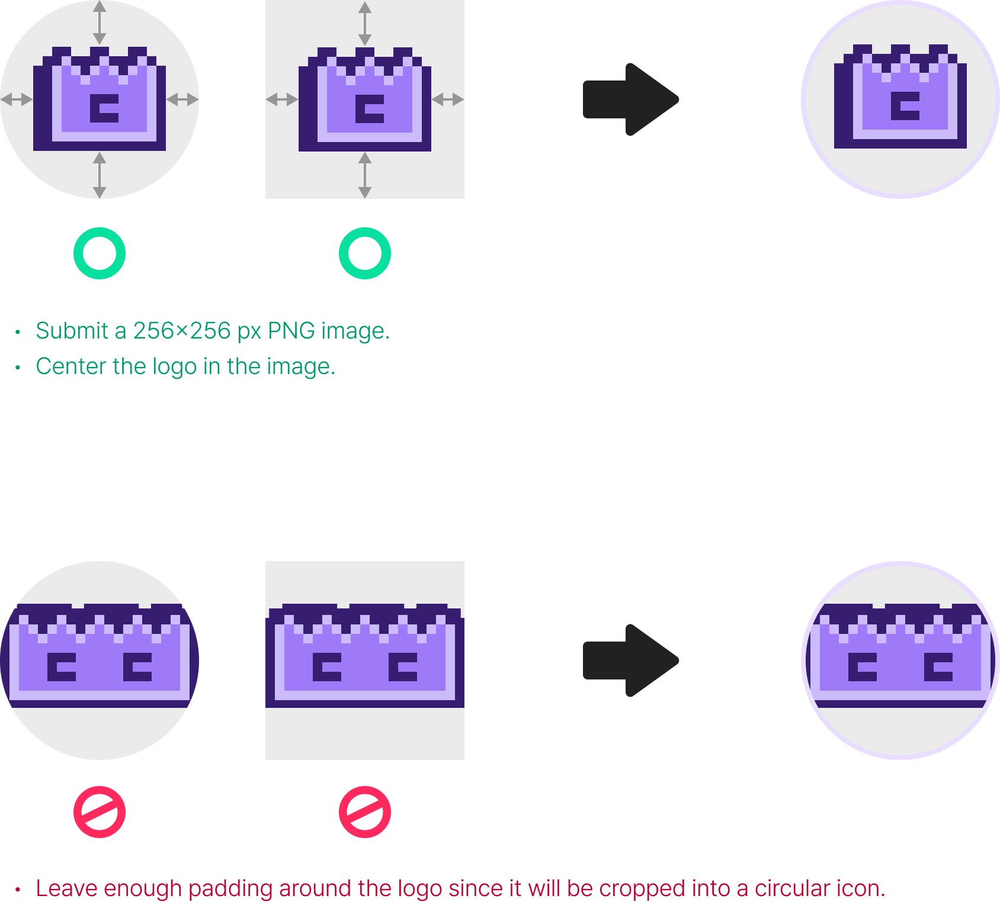

# MeCo Wallet Asset CDN Repository

<div align="center">
  
</div>

This repository is for asset listing requests from token projects.
If your PR is approved and merged to `main`, your icon is served by jsDelivr and appears in MeCo Wallet.

## Prerequisites

- Install Python 3 (official): https://www.python.org/downloads/
- Ensure `pip` is available (official guide): https://pip.pypa.io/en/stable/installation/
- Verify Python and pip are installed:
  ```bash
  python3 --version
  pip3 --version
  ```
- Install Python dependencies:
  ```bash
  pip3 install -r requirements.txt
  ```
- Prepare logo source image file (square image recommended, PNG preferred)
- Logo does not need to be pre-cropped, but it must fit safely inside the circular display area in wallet UI.
- Wallet render preview (how your logo will appear in circular UI):

- Prepare required metadata before running wizard:
  - Asset type: `network` | `native` | `token`
  - `chainRef` (example: `eip155-4352`, `solana-mainnet`)
  - `tokenId` for token assets only

## Who Does What

- Requester: token project submits a PR
- Approver: MeCo Wallet team reviews, approves, and merges

## What Requesters Must Do

1. Fork this repository.
2. Prepare your icon file(s) using one of the following methods:
   - Recommended: run the wizard command below and follow the prompts.
     ```bash
     python3 tools/asset_wizard.py
     ```
   - Need options reference: `python3 tools/asset_wizard.py --help`
   - Manual: place files directly under `assets/` using the `Path Rules` below.
3. Open a Pull Request.

## Path Rules

- Network icon: `assets/networks/{chainRef}.png`
- Native token icon (mainnet projects only): `assets/tokens/native/{chainRef}.png`
- Token icon (non-native project tokens): `assets/tokens/{chainRef}/{tokenId}.png`
- Fallback icon: `assets/fallback/default-token.png`

`chainRef` format: lowercase slug with namespace prefix (for example `eip155-4352`, `solana-mainnet`, `sui-mainnet`).

Token ID rules:

- `eip155-*`: lowercase EVM address (`^0x[a-f0-9]{40}$`)
- `solana-*`: base58 mint address
- `aptos-*` and `sui-*`: lowercase hex with `0x` prefix
- `tron-*`: base58 account format
- Other namespaces: alphanumeric token ID with `._:-` allowed

Examples:

- MemeCore network: `assets/networks/eip155-4352.png`
- Solana native token: `assets/tokens/native/solana-mainnet.png`
- USDC on Ethereum: `assets/tokens/eip155-1/0xa0b86991c6218b36c1d19d4a2e9eb0ce3606eb48.png`
- USDC on Solana: `assets/tokens/solana-mainnet/EPjFWdd5AufqSSqeM2qN1xzybapC8G4wEGGkZwyTDt1v.png`

## Image Rules (Required)

- PNG only
- Exactly `256x256`
- Max file size: `200KB`

## When It Shows In Wallet

After MeCo Wallet approves and merges your PR to `main`:

1. CI validation passes
2. jsDelivr cache refresh runs for changed files
3. The icon is available from the CDN URL and used by MeCo Wallet

## Quick Check After Merge

- Open the expected CDN URL and confirm HTTP 200
- Native token URL template:
  `https://cdn.jsdelivr.net/gh/MeCoWallet/meco-assets@main/assets/tokens/native/{chainRef}.png`
- Non-native token URL template:
  `https://cdn.jsdelivr.net/gh/MeCoWallet/meco-assets@main/assets/tokens/{chainRef}/{tokenId}.png`
- If wallet cache is stale, retry after short cache propagation time

## Disclaimer

- No Verification: Listing in this repository does not imply endorsement by the MeCo Wallet or MemeCore team.
- Safety: Users must do their own research (DYOR). This repository does not audit token contracts.
- Removal: MeCo Wallet may remove assets that violate policy.

## License

This repository is licensed under the MIT License. See `LICENSE`.
